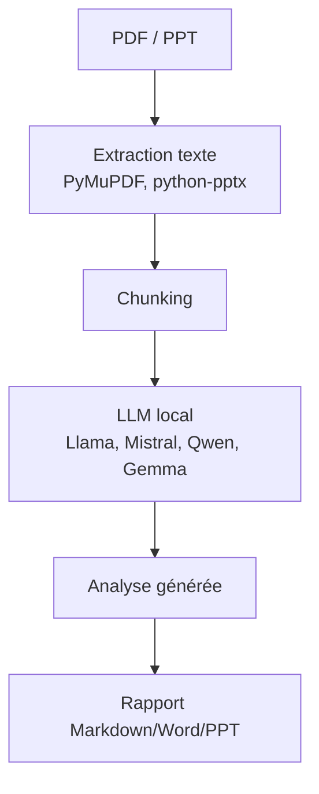
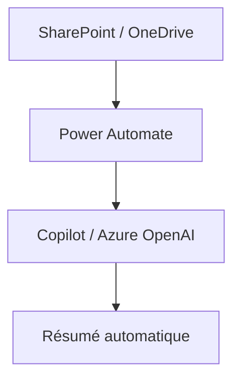
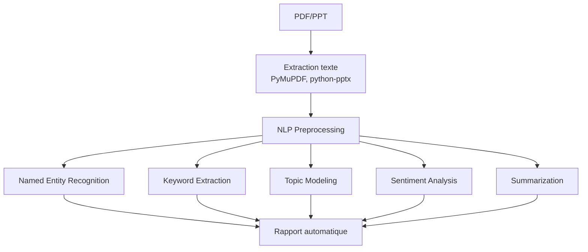
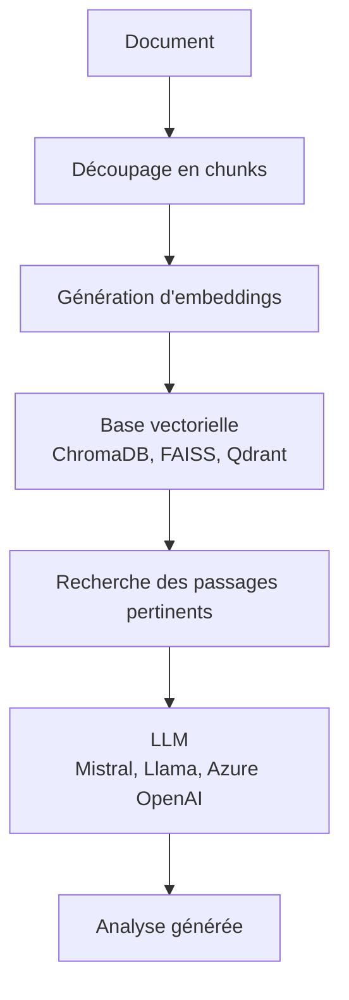
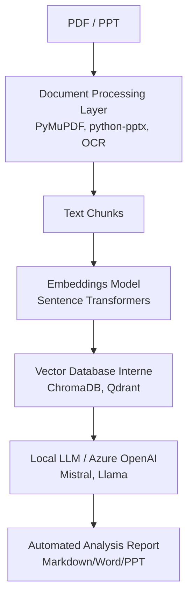

# **Analyse Automatique de Documents : Architectures et Solutions**

Ce document présente plusieurs architectures pour construire un **pipeline automatisé** d'analyse de documents (PDF/PPT).
L'objectif est d'extraire le contenu, de l'analyser, et de produire une synthèse **sans intervention humaine** et **sans envoyer les données vers une API externe** (ex: OpenAI).

---

---

## **Solution 1 — Modèles Open Source Locaux (LLM Local)**

Cette solution reproduit le comportement d'un LLM comme ChatGPT **sans clé API**, en utilisant des modèles open source exécutés localement.

### **Architecture**


### **Environnements d'exécution**
Les modèles peuvent être déployés sur :
- Un **poste local** (pour des tests ou des petits volumes).
- Un **serveur interne** (pour une utilisation en équipe).
- Une **infrastructure cloud privée** (pour une scalabilité contrôlée).

### **Exemples de modèles**
- **Mistral AI** (Mistral, Mixtral)
- **Llama** (Meta)
- **Qwen** (Alibaba)
- **Gemma** (Google)

### **Outils pour le déploiement**
| Outil | Description | Cas d'usage |
|-------|-------------|-------------|
| [Ollama](https://ollama.com) | Outil simple pour exécuter des LLM localement. | Développement local, tests rapides. |
| LM Studio | Interface graphique pour gérer les LLM locaux. | Prototypage, démonstrations. |
| vLLM | Serveur optimisé pour l'inférence de LLM. | Déploiement interne, scalabilité. |

### **Exemple avec Ollama**
1. Télécharger le modèle :
   ```bash
   ollama pull mistral
   ```
2. Utiliser le modèle en Python :
   ```python
   import ollama

   response = ollama.chat(
       model="mistral",
       messages=[
           {"role": "user", "content": "Analyze this document..."}
       ]
   )
   print(response["message"]["content"])
   ```
**Avantage** : Aucune clé API requise.

---

---

## **Solution 2 — Copilot via Microsoft 365**

Si ton entreprise utilise **Microsoft 365**, Copilot offre une intégration native pour l'analyse de documents.

### **Architecture**


### **Mécanismes d'intégration**
- **Microsoft Graph API** : Accès aux documents stockés dans le cloud Microsoft.
- **Azure OpenAI** : Utilisation de modèles LLM hébergés par Microsoft.
- **Copilot Studio** : Personnalisation des workflows d'analyse.
- **Power Automate** : Automatisation des flux de travail.

### **Avantages et Inconvénients**
| **Avantages** | **Inconvénients** |
|---------------|-------------------|
| Conforme au SI entreprise. | Dépend des droits accordés par l'entreprise. |
| Gouvernance déjà en place. | Nécessite souvent l'intervention de l'équipe IT. |

---

---

## **Solution 3 — Pipeline NLP Classique + Modèles Transformers**

Cette approche utilise des **techniques NLP traditionnelles** combinées à des modèles Transformers pour l'analyse et la synthèse.

### **Architecture**


### **Technologies Clés**
| Outil | Rôle |
|-------|------|
| **PyMuPDF** | Extraction de texte depuis les PDF. |
| **python-pptx** | Extraction de texte depuis les PPT. |
| **spaCy** | Traitement NLP classique (NER, tokenization). |
| **Transformers** | Modèles de résumé (ex: BART, T5). |
| **BERTopic** | Modélisation de thèmes. |
| **Sentence Transformers** | Calcul de similarité sémantique. |

### **Avantages et Limites**
| **Avantages** | **Limites** |
|---------------|-------------|
| Contrôle total sur le pipeline. | Moins "intelligent" qu'un LLM généraliste. |
| Pas de fuite de données. | Nécessite une configuration fine pour des résultats optimaux. |
| Industrialisable facilement. | |

---

---

## **Solution 4 — RAG Interne (Recommandé pour l'Entreprise)**

**RAG (Retrieval Augmented Generation)** est l'architecture la plus utilisée aujourd'hui pour l'analyse de documents en entreprise.
Elle combine **recherche d'informations pertinentes** et **génération de texte** via un LLM.

### **Architecture**


### **Exemple d'utilisation**
1. **Chargement des documents** :
   ```
   - Rapport annuel SG 2024.pdf
   - Politique risque crédit.pdf
   - AI Act.pdf
   ```
2. **Requête utilisateur** :
   > *"Quels sont les principaux risques identifiés ?"*
3. **Processus RAG** :
   - Le système **recherche les passages pertinents** dans les documents.
   - Il les **transmet au LLM** avec la requête.
   - Le LLM **génère une réponse** basée sur ces passages.

### **Technologies Clés**
| Outil | Rôle |
|-------|------|
| **LangChain** | Orchestration du pipeline RAG. |
| **LlamaIndex** | Indexation et recherche de documents. |
| **ChromaDB / FAISS / Qdrant** | Bases de données vectorielles pour stocker les embeddings. |

---
---

## **Architecture Recommandée pour ton Contexte (DataLab / Model Risk / Banque)**

Pour un **environnement professionnel** (ex: analyse de rapports IFRS9, politiques de risque), privilégie cette architecture **RAG + LLM local/privé** :



### **Exemple de Sortie**
```markdown
**Document analysé** : IFRS9 Model Monitoring Report

**Résumé exécutif** :
...

**Principales conclusions** :
1. ...
2. ...
3. ...

**Risques potentiels** :
...

**Actions recommandées** :
...
```

---
---

## **Prototype Sans Dépendance IT**

Pour un **premier prototype** utilisant ton environnement actuel (Python, NLP, GitHub, modèles ML), suis ces étapes :

### **Étape 1 : Extraction de Texte**
```python
# PDF
import fitz  # PyMuPDF
doc = fitz.open("document.pdf")
text = "".join([page.get_text() for page in doc])

# PPT
from pptx import Presentation
prs = Presentation("presentation.pptx")
text = "\n".join([slide.text for slide in prs.slides])
```

### **Étape 2 : Génération d'Embeddings**
```python
from sentence_transformers import SentenceTransformer

model = SentenceTransformer("sentence-transformers/all-MiniLM-L6-v2")
embedding = model.encode(text)
```

### **Étape 3 : LLM Local**
Utilise **Ollama + Mistral** pour l'analyse :
```bash
ollama pull mistral
```
```python
import ollama
response = ollama.chat(model="mistral", messages=[{"role": "user", "content": "Analyze this text: " + text}])
```

### **Étape 4 : Génération du Rapport**
- Structure les résultats en **Markdown** ou **Word**.
- Utilise des templates pour standardiser la sortie.

---
---

## **Comparaison des Solutions**

| **Solution**               | **Clé API** | **Automatique** | **Intégration Entreprise** | **Qualité** |
|----------------------------|-------------|-----------------|----------------------------|-------------|
| OpenAI API                 | Oui         | Oui             | Dépend validation IT       | ⭐⭐⭐⭐⭐     |
| Copilot Entreprise         | Non         | Oui             | ⭐⭐⭐⭐⭐                    | ⭐⭐⭐⭐⭐     |
| LLM Local (Ollama)         | Non         | Oui             | ⭐⭐⭐⭐                      | ⭐⭐⭐⭐      |
| Transformers (BART)        | Non         | Oui             | ⭐⭐⭐⭐⭐                    | ⭐⭐⭐       |
| NLP Classique              | Non         | Oui             | ⭐⭐⭐⭐⭐                    | ⭐⭐        |

---
---
## **Recommandation Finale**

Pour ton cas précis (**DataLab / Model Risk / Banque**), la solution **RAG + LLM local (Mistral/Llama)** ou **RAG + Azure OpenAI** (si autorisé par ton entreprise) est la plus adaptée.
Elle offre :
- Un **contrôle total** sur les données (pas de fuite).
- Une **qualité d'analyse élevée** grâce aux LLM.
- Une **industrialisation facile** pour des usages professionnels.

**Évite** de partir sur un modèle comme `facebook/bart-large-cnn` seul, car il manque de flexibilité pour des analyses documentaires complexes.

---
