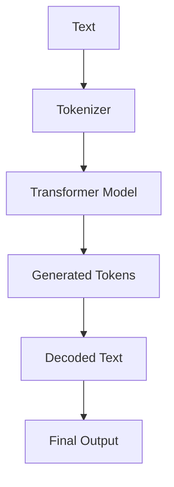

# Understanding the Hugging Face Transformers Pipeline

## Overview

The `pipeline` function is a high-level API provided by the **Hugging Face Transformers** library.

Its goal is to simplify the usage of pretrained Transformer models by hiding the complexity of:

- model loading,
- tokenizer management,
- text preprocessing,
- inference execution,
- output post-processing.

Instead of manually handling each step, the user can perform complex NLP tasks with only a few lines of code.

Example:

```python
from transformers import pipeline

summarizer = pipeline(
    "summarization",
    model="facebook/bart-large-cnn"
)

summary = summarizer(
    "This is a long text that must be summarized."
)

print(summary)
```

For French documents use the model:
```python
model="facebook/mbart-large-50-many-to-many-mmt"
```

---

# What does a Transformers Pipeline contain?

When creating a pipeline:

```python
summarizer = pipeline(
    "summarization",
    model="facebook/bart-large-cnn"
)
```

Hugging Face automatically builds a complete NLP processing chain:

```
Pipeline
│
├── Model
│     ├── Neural network architecture
│     ├── Model weights
│     └── Configuration
│
├── Tokenizer
│     ├── Vocabulary
│     ├── Tokenization rules
│     └── Special tokens
│
├── Preprocessing
│     ├── Text normalization
│     ├── Tokenization
│     ├── Padding
│     └── Truncation
│
├── Inference Engine
│     ├── CPU/GPU execution
│     ├── Text generation strategy
│     ├── Beam search
│     └── Sampling methods
│
└── Postprocessing
      ├── Token decoding
      ├── Special token removal
      └── Final text generation
```

---

# 1. The Model Component

The model is the neural network responsible for learning and generating predictions.

In the example:

```python
model="facebook/bart-large-cnn"
```

Hugging Face automatically downloads:

- the model architecture,
- the pretrained weights,
- the configuration file.

The model is based on the BART Transformer architecture.

The model object can be inspected:

```python
print(type(summarizer.model))
```

Example output:

```python
<class 'transformers.models.bart.modeling_bart.BartForConditionalGeneration'>
```

The model contains millions of learned parameters obtained during pretraining and fine-tuning.

---

# 2. The Tokenizer Component

Neural networks cannot directly process text.

The tokenizer converts human-readable text into numerical representations.

Example:

Input text:

```
I love NLP.
```

Tokenization:

```
["I", "love", "NLP", "."]
```

Conversion into token IDs:

```
[100, 2345, 4567, 91]
```

These numerical values are the actual inputs provided to the Transformer model.

The tokenizer can be accessed:

```python
print(type(summarizer.tokenizer))
```

---

# 3. Preprocessing Stage

Before entering the model, the pipeline automatically performs several operations:

## Tokenization

The text is converted into token IDs.

## Padding

Sequences are adjusted to the required size when processing batches.

## Truncation

Texts exceeding the model maximum length are truncated.

For example:

```python
inputs = tokenizer(
    text,
    return_tensors="pt",
    truncation=True
)
```

The pipeline performs these operations automatically.

---

# 4. Inference Stage

The inference stage corresponds to the actual execution of the neural network.

For text generation tasks, the model internally calls:

```python
model.generate(...)
```

Several decoding strategies can be used:

## Greedy Search

The model always selects the most probable next token.

Advantages:

- fast,
- deterministic.

Disadvantages:

- may produce repetitive text.

---

## Beam Search

The model keeps several possible sequences during generation.

Example:

```python
num_beams=4
```

Advantages:

- usually produces better summaries,
- improves coherence.

---

## Sampling Methods

Other strategies include:

- top-k sampling,
- top-p (nucleus) sampling,
- temperature scaling.

These methods introduce more diversity into generated text.

---

# 5. Postprocessing Stage

After generation, the model produces token IDs.

Example:

```
[0, 154, 621, 95, 2]
```

The tokenizer converts these IDs back into readable text:

```python
tokenizer.decode(
    tokens,
    skip_special_tokens=True
)
```

Final result:

```
The company announced new financial results.
```

---

# What happens internally?

When executing:

```python
summary = summarizer(text)
```

the pipeline performs approximately the following steps:

```python
# Step 1: Convert text into tokens
inputs = tokenizer(text)


# Step 2: Convert tokens into PyTorch tensors
inputs = tokenizer(
    text,
    return_tensors="pt"
)


# Step 3: Generate output token IDs
summary_ids = model.generate(
    **inputs,
    max_length=100
)


# Step 4: Convert tokens back into text
summary = tokenizer.decode(
    summary_ids[0],
    skip_special_tokens=True
)
```

The pipeline hides all these technical steps.

---

# Available Hugging Face Pipelines

Hugging Face provides many predefined pipelines.

| Pipeline | Description |
|----------|-------------|
| `sentiment-analysis` | Sentiment classification |
| `text-classification` | General text classification |
| `summarization` | Automatic text summarization |
| `translation` | Machine translation |
| `question-answering` | Extract answers from text |
| `fill-mask` | Masked language modeling |
| `text-generation` | Text generation |
| `token-classification` | Named Entity Recognition (NER) |
| `zero-shot-classification` | Classification without training examples |
| `feature-extraction` | Generate embeddings |
| `image-classification` | Image classification |
| `automatic-speech-recognition` | Speech-to-text |
| `text-to-speech` | Text generation into speech |

---

# Example: Text Summarization Pipeline

```python
from transformers import pipeline


summarizer = pipeline(
    "summarization",
    model="facebook/bart-large-cnn"
)


text = """
Artificial intelligence is transforming many industries.
Machine learning models are now widely used for prediction,
classification and natural language processing tasks.
"""


summary = summarizer(
    text,
    max_length=50,
    min_length=10,
    do_sample=False
)


print(summary[0]["summary_text"])
```

---

# Offline Usage

During the first execution, the model is downloaded from the Hugging Face Hub.

The files are stored locally:

```
~/.cache/huggingface/
```

After downloading, the model can be reused without an internet connection.

Example:

```python
pipeline(
    "summarization",
    model="facebook/bart-large-cnn",
    local_files_only=True
)
```

---

# Summary

The Hugging Face `pipeline` is not a model itself.

It is a complete processing wrapper that combines:

- a pretrained Transformer model,
- a tokenizer,
- preprocessing operations,
- inference algorithms,
- postprocessing logic.

It provides a simple interface for advanced NLP tasks while hiding the complexity of Transformer architectures.

In practice:


The pipeline allows researchers and developers to use state-of-the-art NLP models with only a few lines of Python code.
